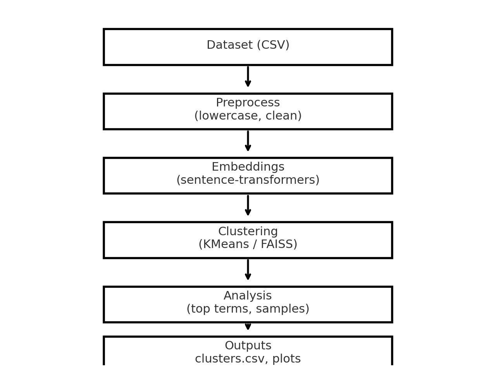

# NoLimit Indonesia — Data Scientist Hiring Test (Clustering) — Firza

This repository implements text clustering using Hugging Face sentence-transformers embeddings
and KMeans. It satisfies the NoLimit test requirements.

## ✅ Task
**B. Clustering — topic discovery / grouping texts using embeddings.**

## 🧱 Pipeline
1. Load texts (`sample_data.csv` or your own CSV with a `text` column).
2. Preprocess (light: lowercase).
3. Encode to embeddings using `sentence-transformers` (default: `paraphrase-multilingual-MiniLM-L12-v2`).
4. Cluster with **KMeans** (`sklearn`) → choose `k` manually or use heuristic (elbow/silhouette).
5. Summarize clusters with top TF-IDF terms + show sample texts.
6. Visualize clusters via **PCA/UMAP** (PNG saved).

See `flowchart.png` for the end-to-end diagram.

## 📦 Files
- `clustering.py` — runnable script (CLI).
- `clustering.ipynb` — notebook version.
- `indonesia_topics_2025.csv` — small sample dataset for local verification.
- `flowchart.png` — mandatory flowchart of the pipeline.
- `requirements.txt` — dependencies.
- `app.py` — optional Streamlit app (bonus).

## 📊 Example Output
- List of clusters with sample texts printed to console and saved to `clusters.csv`.
- `plot_pca.png` and `plot_umap.png` (if UMAP installed).

## ▶️ Quickstart
```bash
# 1) Create and activate environment
uv venv .venv && source .venv/bin/activate  # or python -m venv .venv

# 2) Install requirements
pip install -r requirements.txt

# 3) Run clustering
python clustering.py --data sample_data.csv --k 6 --model paraphrase-multilingual-MiniLM-L12-v2
# Optional: try a different model, e.g. intfloat/multilingual-e5-base
python clustering.py --data sample_data.csv --k 6 --model intfloat/multilingual-e5-base

# 4) Run Streamlit app
streamlit run app.py
```

## 🧪 Notebook
Open `clustering.ipynb` and run all cells to reproduce the results.

## 📚 Models
- Default: `sentence-transformers/paraphrase-multilingual-MiniLM-L12-v2` (multilingual, light, good quality)
- Alternatives:
  - `intfloat/multilingual-e5-base` (strong multilingual embeddings — use with e5 prompting)
  - `sentence-transformers/all-MiniLM-L6-v2` (English-focused, light)
> All from Hugging Face Hub. Replace via `--model` flag.

## 🔍 Embeddings & Search
- Embeddings computed via `sentence-transformers`.
- Clustering via `KMeans` (`sklearn`).
- Optional: FAISS flat index for nearest-neighbor search within / across clusters (demo included).

## 📈 Evaluation (unsupervised)
- Silhouette score (higher is better; used as heuristic).
- Human inspection of top terms & sample texts per cluster.

## 🗂️ Dataset
- `indonesia_topics_2025.csv` provided for quick verification (authored by repository owner).
**License of `indonesia_topics_2025.csv`: CC BY 4.0** (© 2025 firza; attribution required).

## 🧩 Flowchart


## 🔒 License
- Code: MIT
- Sample data: CC BY 4.0

## 👤 Author
Firza El Hakim
